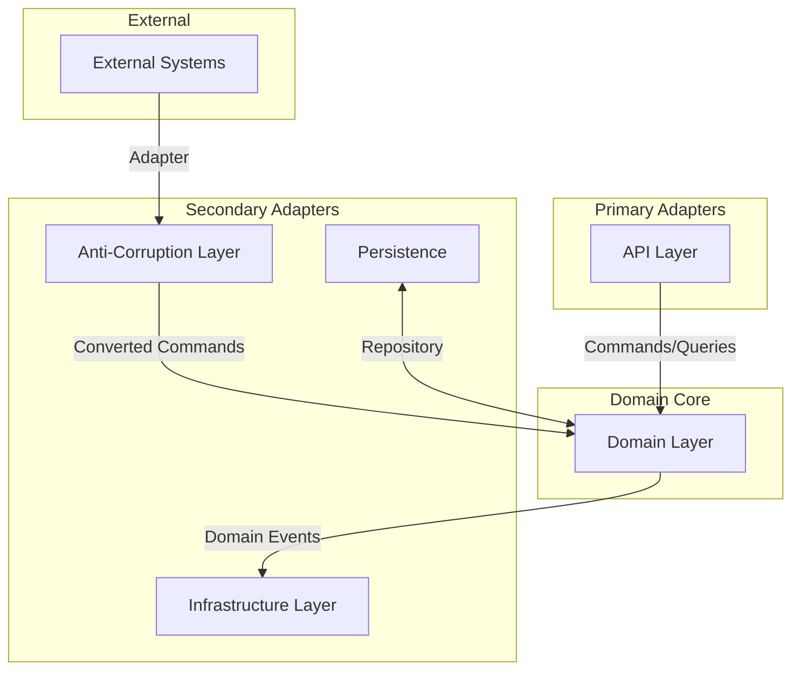
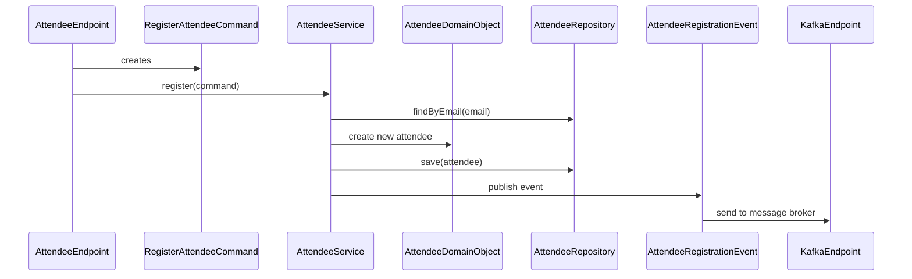

# ADR 002: File Relationships and Interaction

**Date:** 2025-05-06  
**Status:** Accepted  
**Deciders:** Development Team  

## Context and Problem Statement

Our conference management system uses Domain-Driven Design and Hexagonal Architecture to structure the codebase. To ensure clear understanding of the system's components and their interactions, we need to document the relationships between files and modules.

## Decision Drivers

* Need for clear visibility of system architecture
* Importance of understanding component relationships
* Desire to maintain clean separation of concerns
* Documentation value for onboarding new team members

## Decision Outcome

We've decided to document the key file relationships and interactions using diagrams and written explanations to provide a comprehensive overview of our architecture.

### Core Components Interaction

The system follows a Hexagonal Architecture pattern where the domain model is at the center, and various adapters connect it to the outside world:

### Key File Relationships

## File Structure Organization

Our file structure is organized around domain concepts rather than technical layers:

1. **API Layer** (`api` package):
   * Contains value objects, commands, and events that define the public API
   * Examples: `RegisterAttendeeCommand.java`, `AttendeeValueObject.java`

2. **Domain Layer** (`domain` package):
   * Contains the core domain model and business logic
   * Examples: `AttendeeDomainObject.java`, `AttendeeService.java`

3. **Infrastructure Layer** (`infrastructure` package):
   * Contains endpoints and external system integrations
   * Examples: `AttendeeEndpoint.java`, `KafkaEndpoint.java`

4. **Persistence Layer** (`persistence` package):
   * Contains repository interfaces and entity classes
   * Examples: `AttendeeRepository.java`, `AttendeeEntity.java`

5. **Anti-Corruption Layer** (`anticorruption` package):
   * Contains adapters for external systems with different models
   * Example: `salesteam` package with classes like `SalesteamEndpoint.java`

## Validation

The success of this file organization will be validated by:

* Ease of understanding the system for new team members
* Ability to make changes with minimal impact across layers
* Clean separation of concerns in the codebase
* Maintainability and testability of individual components

## Related Decisions

* ADR 001: Project Goal and Value
* ADR 003: Bounded Context Definition (upcoming)

## References

* [Organizing Layers Using Hexagonal Architecture, DDD, and Spring](https://www.baeldung.com/hexagonal-architecture-ddd-spring) - Best practices for organizing application layers
* [The Ultimate Guide to Mastering Hexagonal Architecture: Focus on the Domain](https://scalastic.io/en/hexagonal-architecture-domain/) - Comprehensive guide on domain-centric design in hexagonal architecture
* [Hexagonal Architecture: Structuring a Project and the Influence of Granularity](https://medium.com/@TonyBologni/hexagonal-architecture-structuring-a-project-and-the-influence-of-granularity-df4e0851ab5c) - Practical insights on project structuring