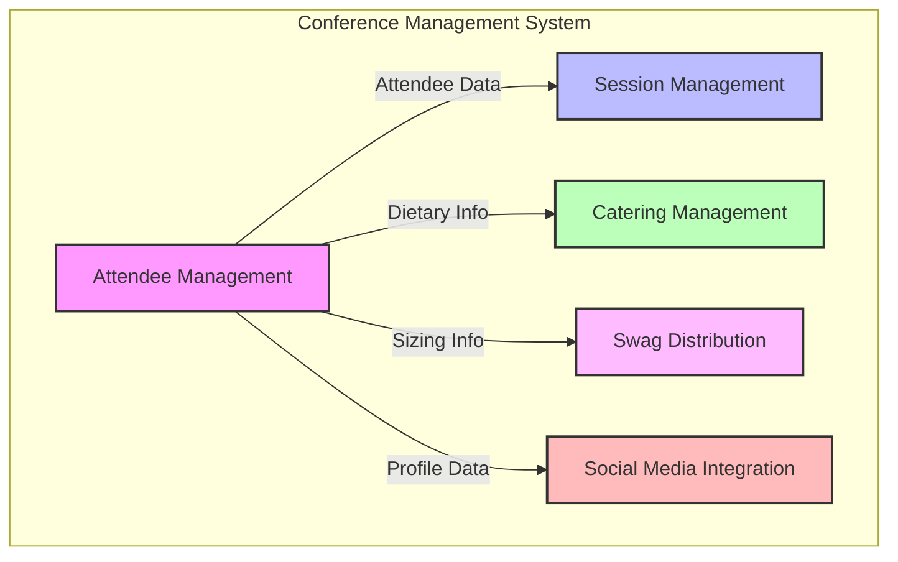

# ADR 003: Bounded Context Definition

**Date:** 2025-05-06  
**Status:** Accepted  
**Deciders:** Development Team  

## Context and Problem Statement

In a Domain-Driven Design approach, defining clear bounded contexts is crucial to manage complexity and ensure that models remain consistent and meaningful within their specific domains. We need to establish the primary bounded contexts for our conference management system to guide development and integration efforts.

## Decision Drivers

* Need to manage complexity in a large domain
* Different subdomains have different requirements and models
* Desire to establish clear team responsibilities
* Need for explicit context boundaries for effective integration

## Considered Options

* Single bounded context for the entire conference system
* Multiple bounded contexts based on functional areas
* Multiple bounded contexts based on business capabilities

## Decision Outcome

We've chosen to define multiple bounded contexts based on business capabilities, as this aligns most closely with the natural divisions in the domain and supports team autonomy.

### Primary Bounded Contexts

#### Attendee Management Context

**Primary Responsibility**: Handle registration, authentication, profile management, and communication with attendees.

**Boundary**:
- Includes: Attendee identity, contact information, preferences, registration status
- Excludes: Session scheduling, catering details, swag inventory

**Key Entities**: Attendee, Address, Badge

**Team Ownership**: Attendee Experience Team

#### Session Management Context

**Primary Responsibility**: Manage speakers, talks, session scheduling, room assignments, and attendee session registration.

**Boundary**:
- Includes: Sessions, speakers, schedules, rooms, capacity management
- Excludes: Attendee personal details beyond identification, catering details

**Key Entities**: Session, Speaker, Room, Schedule

**Team Ownership**: Content Team

#### Catering Management Context

**Primary Responsibility**: Handle meal planning, dietary accommodations, vendor coordination, and meal scheduling.

**Boundary**:
- Includes: Meals, dietary preferences, catering vendors, meal schedules
- Excludes: Attendee management, session details beyond timing

**Key Entities**: Meal, Dietary Requirement, Catering Vendor

**Team Ownership**: Operations Team

#### Swag Distribution Context

**Primary Responsibility**: Manage swag inventory, sizing, distribution logistics, and tracking.

**Boundary**:
- Includes: Swag items, sizes, inventory, distribution records
- Excludes: Attendee management beyond identification

**Key Entities**: Swag Item, Inventory, Distribution Record

**Team Ownership**: Operations Team

#### Social Media Integration Context

**Primary Responsibility**: Handle promotion, social sharing, engagement tracking, and analytics.

**Boundary**:
- Includes: Social platforms, sharing templates, engagement metrics
- Excludes: Detailed attendee management beyond public profiles

**Key Entities**: Social Platform, Post, Engagement Metric

**Team Ownership**: Marketing Team

## Validation

The success of these bounded context definitions will be validated by:

* Minimal coupling between contexts
* Clear and focused domain models within each context
* Effective communication patterns between contexts
* Team autonomy in evolving their contexts

## Related Decisions

* ADR 001: Project Goal and Value
* ADR 002: File Relationships and Interaction
* ADR 004: Core Domain Identification (upcoming)
* ADR 006: Context Mapping (upcoming)

## References

* [Using Bounded Context for Effective Domain-Driven Design](https://www.techtarget.com/searchapparchitecture/tip/Using-bounded-context-for-effective-domain-driven-design) - Best practices for establishing and identifying bounded contexts
* [DDD Beyond the Basics: Mastering Multi-Bounded Context Integration](https://medium.com/ssense-tech/ddd-beyond-the-basics-mastering-multi-bounded-context-integration-ca0c7cec6561) - Advanced techniques for bounded context integration
* [Service Oriented Architecture Best Practices and Bounded Contexts](https://medium.com/@kyodo-tech/service-oriented-architecture-best-practices-and-bounded-contexts-612f23de1374) - Practical insights on implementing bounded contexts in service-oriented architectures