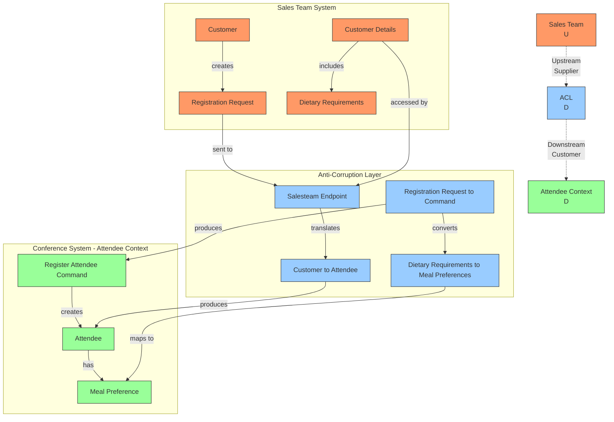

# ADR 006: Context Map - Integration with Sales Team System using Red Hat Integration Technologies

**Date:** 2025-05-06  
**Status:** Accepted  
**Deciders:** Development Team, Sales Team Representatives  

## Context and Problem Statement

Our conference management system needs to integrate with the existing Sales Team system, which manages customer relationships and initial registrations. We need to define the relationship between these two bounded contexts and establish appropriate integration patterns to ensure effective communication while maintaining domain integrity. We'll leverage Red Hat Integration solutions to implement this integration.

## Decision Drivers

* Need to reuse existing customer data from the Sales Team system
* Different domain models and terminology between systems
* Desire to protect our domain model from external influence
* Need for reliable data synchronization between contexts
* Alignment with Red Hat's enterprise integration patterns and technologies
* Preference for scalable, maintainable integration approach using Red Hat's middleware solutions

## Considered Options

1. **Shared Kernel**: Share a common model between both contexts
2. **Customer/Supplier**: Establish a customer-supplier relationship
3. **Conformist**: Adapt our model to match the Sales Team model
4. **Anti-Corruption Layer**: Create a translation layer between contexts using Red Hat Integration
5. **Open Host Service**: Define a protocol for integration with Red Hat API Management

## Decision Outcome

**Chosen option: Anti-Corruption Layer with Customer/Supplier Relationship implemented via Red Hat Integration**

We've decided to implement an Anti-Corruption Layer (ACL) to protect our Attendee Management bounded context from the Sales Team system's domain model, while establishing a Customer/Supplier relationship where the Sales Team system is the upstream supplier and our system is the downstream customer. This integration will be implemented using Red Hat Integration technologies, particularly Red Hat Fuse and Red Hat AMQ.

### Context Map



### Integration Strategy

1. **Anti-Corruption Layer Components**:
   - `SalesteamEndpoint`: Handles API communication with Sales Team system using Red Hat Fuse (Apache Camel)
   - `Customer`/`CustomerDetails`: Representations of Sales Team domain objects
   - Translation services to convert between domain models via Red Hat Fuse integration routes

2. **Communication Pattern**:
   - Sales Team system triggers registration events that are published to Red Hat AMQ (ActiveMQ Artemis)
   - Our ACL consumes these events from the message broker and translates them
   - Commands are created in our domain language
   - Our domain model processes these commands
   - Red Hat 3scale API Management provides API governance, security, and analytics

3. **Data Synchronization**:
   - Initial registration data comes from Sales Team system through Red Hat Fuse integration routes
   - Event sourcing via Red Hat AMQ Streams (Kafka) for reliable, scalable event processing
   - Subsequent attendee updates in our system are not synced back
   - Reports are generated for the Sales Team in their language via Red Hat Process Automation Manager

### Technical Implementation

Our integration solution will leverage Red Hat's enterprise integration portfolio:

1. **Red Hat Fuse (Apache Camel)**: For developing integration routes that connect our systems and transform data between domains.

2. **Red Hat AMQ**: As the messaging platform to enable asynchronous, reliable communication between contexts.

3. **Red Hat AMQ Streams (Kafka)**: For event streaming of critical domain events that may need to be processed by multiple consumers.

4. **Red Hat 3scale API Management**: To manage, secure, and monitor the APIs exposed by both bounded contexts.

5. **Red Hat OpenShift**: As the deployment platform for all integration components, providing scalability and container orchestration.

Configuration example for Red Hat Fuse integration route:

```xml
<camelContext xmlns="http://camel.apache.org/schema/spring">
  <route id="salesTeamCustomerRegistration">
    <from uri="amqp:queue:SALES.CUSTOMER.REGISTRATION"/>
    <unmarshal>
      <json library="Jackson" unmarshalTypeName="com.salesteam.model.RegistrationRequest"/>
    </unmarshal>
    <bean ref="salesTeamTranslator" method="convertToAttendeeCommand"/>
    <marshal>
      <json library="Jackson"/>
    </marshal>
    <to uri="http://attendee-service/api/register"/>
  </route>
</camelContext>
```

### Consequences

* **Positive:**
  * Our domain model remains pure and focused on our core domain
  * Changes in the Sales Team system don't directly impact our model
  * Clear separation of concerns between systems
  * Terminology differences are explicitly handled
  * Red Hat Integration technologies provide enterprise-grade reliability and observability
  * Built-in monitoring and management via Red Hat OpenShift
  * Scalable architecture capable of handling peak registration periods

* **Negative:**
  * Additional development effort to create and maintain the ACL
  * Potential performance overhead from translation
  * Need to update the ACL when either system changes
  * Learning curve for team members not familiar with Red Hat Integration tools

## Validation

The success of this context mapping approach will be validated by:

* Reliable data flow between systems without corruption or loss
* Ability to evolve our domain model independently from the Sales Team system
* Minimal maintenance burden from the integration over time
* Clear understanding of the relationship by both teams
* Performance metrics from Red Hat AMQ and Red Hat Fuse meeting SLAs
* Successful handling of peak loads during conference registration periods

## Related Decisions

* ADR 003: Bounded Context Definition
* ADR 005: Ubiquitous Language Strategy
* ADR 007: Aggregate Design for Attendee
* ADR 008: Deployment Strategy for Red Hat OpenShift Container Platform 4.18

## References

* [Context Mapping – Strategic Domain-Driven Design](https://www.infoq.com/articles/ddd-contextmapping/) - Comprehensive guide to different context mapping patterns
* [Implementing Domain-Driven Design: Anti-Corruption Layer Pattern](https://www.culttt.com/2014/12/24/anti-corruption-layer-pattern) - Detailed explanation of Anti-Corruption Layer implementation
* [Red Hat Fuse Documentation](https://access.redhat.com/documentation/en-us/red_hat_fuse/) - Official documentation for Red Hat's enterprise integration platform
* [Red Hat AMQ Messaging](https://www.redhat.com/en/technologies/jboss-middleware/amq) - Enterprise messaging platform used in the integration strategy