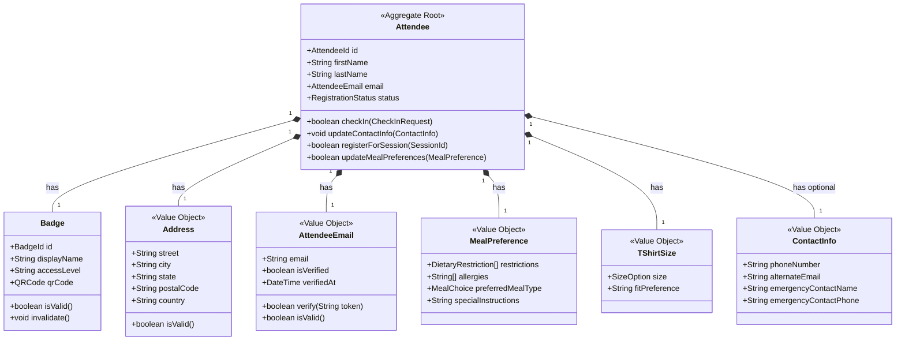

# ADR 007: Aggregate Design for Attendee Entity

**Date:** 2025-05-06  
**Status:** Accepted  
**Deciders:** Development Team  

## Context and Problem Statement

In Domain-Driven Design, aggregates are clusters of domain objects that are treated as a single unit for data changes. We need to design the Attendee aggregate to encapsulate the core attendee-related data and behavior while maintaining proper boundaries and invariants.

## Decision Drivers

* Need for clear consistency boundaries
* Desire to encapsulate related business rules
* Performance considerations for data access patterns
* Protection of domain invariants
* Complexity management

## Considered Options

1. **Minimal Attendee Aggregate**: Only include essential attendee data, with references to related entities
2. **Comprehensive Attendee Aggregate**: Include all attendee-related entities within a single aggregate
3. **Multiple Related Aggregates**: Split attendee information across multiple related aggregates

## Decision Outcome

**Chosen option: Attendee as Focused Aggregate Root with Select Value Objects**

We've decided to design the Attendee aggregate as a focused aggregate root that contains only closely related entities and value objects that must be updated together to maintain consistency.

### Aggregate Structure

### Key Design Decisions

1. **Attendee as Aggregate Root**:
   - Attendee is the entry point for all operations on the aggregate
   - Contains identity and core attendee information
   - Controls access to all contained entities and value objects

2. **Badge as Entity**:
   - Badge is a separate entity with its own identity
   - Closely tied to Attendee lifecycle
   - Contains access control information

3. **Value Objects for Immutable Concepts**:
   - Address, Email, MealPreference, TShirtSize, and ContactInfo are value objects
   - Immutable and replaceable as a whole
   - No identity of their own

4. **Explicit Boundary**:
   - Session registrations are referenced by ID but not contained within the aggregate
   - Swag items received are tracked separately
   - Social media interactions are in a different aggregate

5. **Consistency Rules**:
   - All invariants within the aggregate must be satisfied in a single transaction
   - References to other aggregates are eventually consistent
   - Badge cannot exist without an Attendee

### Lifecycle and Persistence

The Attendee aggregate will be:
1. Created during registration (either direct or via sales team integration)
2. Updated through explicit methods that enforce business rules
3. Persisted as a unit in the database, with optimistic concurrency control
4. Referenced by other aggregates through its identity (AttendeeId)

## Consequences

* **Positive:**
  * Clear boundaries around attendee data
  * Enforcement of business rules in a single place
  * Simplified concurrency management
  * Improved performance by grouping commonly accessed data

* **Negative:**
  * Potential for large object graphs if not carefully managed
  * Need for explicit handling of references to other aggregates
  * Complexity in managing eventual consistency across aggregate boundaries

## Validation

The success of this aggregate design will be validated by:

* Ability to maintain invariants during complex operations
* Performance in high-throughput scenarios
* Clarity of code for developers working with the Attendee aggregate
* Ease of evolving the model as requirements change

## Related Decisions

* ADR 003: Bounded Context Definition
* ADR 004: Core Domain Identification
* ADR 005: Ubiquitous Language Strategy
* ADR 006: Context Map Integration

## References

* [Effective Aggregate Design](https://dddcommunity.org/wp-content/uploads/files/pdf_articles/Vernon_2011_1.pdf) - Vaughn Vernon's seminal paper on DDD aggregate design principles
* [Aggregate Pattern in Domain-Driven Design](https://martinfowler.com/bliki/DDD_Aggregate.html) - Martin Fowler's explanation of the aggregate pattern
* [Domain-Driven Design: Tackling Complexity - Aggregates](https://kalele.io/blog-posts/domain-driven-design-aggregates/) - Practical guide to designing effective aggregates
* [Domain Modeling Made Functional](https://fsharpforfunandprofit.com/ddd/) - Alternative perspective on modeling aggregates using functional programming concepts