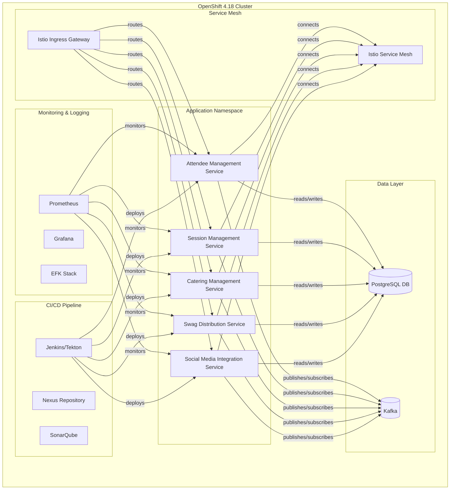

# ADR 008: Deployment Strategy for OpenShift 4.18

**Date:** 2025-05-06  
**Status:** Accepted  
**Deciders:** Development Team, Platform Team  

## Context and Problem Statement

Our conference management system needs to be deployed to production using Red Hat OpenShift Container Platform 4.18. We need to determine the best approach for deploying our Domain-Driven Design and Hexagonal Architecture based application to OpenShift while ensuring maintainability, scalability, and alignment with our domain boundaries.

## Decision Drivers

* Need for reliable and scalable deployment
* Desire to maintain separation of bounded contexts in deployment
* Support for continuous delivery pipeline
* Efficient resource utilization
* Alignment with Red Hat's deployment best practices for enterprise open source solutions
* Observability and monitoring requirements
* Leverage Red Hat's hybrid cloud capabilities for future extensibility

## Considered Options

1. **Monolithic Deployment**: Deploy the entire system as a single application
2. **Microservices per Bounded Context**: Deploy each bounded context as a separate microservice
3. **Hybrid Approach**: Deploy core domains as separate services with supporting domains grouped together

## Decision Outcome

**Chosen option: Microservices per Bounded Context**

We've decided to deploy each bounded context as a separate microservice on Red Hat OpenShift Container Platform 4.18, which aligns with our domain boundaries and provides appropriate isolation.

### Deployment Architecture



### Implementation Details

1. **Container Images**:
   - Each bounded context will be built into a separate container image
   - Images will be stored in the OpenShift internal registry or Red Hat Quay
   - Base images will use Red Hat's Universal Base Image (UBI) for compliance and enterprise support

2. **Deployment Resources**:
   - Each service will be deployed using Kubernetes Deployments
   - Services will expose their APIs through OpenShift Service resources
   - Routes will be configured for external access where needed
   - Resource requests and limits will be explicitly set
   - Leverage Red Hat OpenShift's built-in horizontal pod autoscaling

3. **Configuration Management**:
   - Configuration will be stored in ConfigMaps and Secrets
   - Environment-specific configuration will be managed through OpenShift projects
   - Sensitive information will be stored in Secrets with appropriate access controls
   - Use Red Hat Advanced Cluster Management for multi-cluster configurations

4. **Persistence Strategy**:
   - Each bounded context will have its own schema in Red Hat OpenShift Data Foundation (formerly OpenShift Container Storage)
   - Red Hat OpenShift Database Access will be used to provision and manage database resources
   - Red Hat OpenShift Operators will manage database provisioning and maintenance
   - Backup and recovery processes will be implemented using Red Hat OpenShift API for Data Protection

5. **Service Communication**:
   - Synchronous communication via REST/gRPC for immediate consistency requirements
   - Asynchronous communication via Red Hat AMQ Streams (Kafka) for eventual consistency patterns
   - Red Hat Service Mesh (based on Istio) for managing communication, security, and observability

6. **CI/CD Pipeline**:
   - Pipeline will be implemented using Red Hat OpenShift Pipelines (based on Tekton)
   - Red Hat OpenShift GitOps (ArgoCD) for declarative, GitOps-based deployments
   - Deployment will be coordinated to maintain system integrity
   - Automated tests will validate both individual services and integration points

7. **Health, Metrics, and Logging**:
   - Each service will implement health endpoints (liveness/readiness)
   - Red Hat OpenShift Container Platform monitoring stack based on Prometheus and Grafana
   - Distributed tracing with Red Hat OpenShift distributed tracing platform (Jaeger)
   - Centralized logging with Red Hat OpenShift logging (based on Elasticsearch, Fluentd, Kibana)

### OpenShift-Specific Configurations

```yaml
# Example Deployment for Attendee Service
apiVersion: apps/v1
kind: Deployment
metadata:
  name: attendee-service
  labels:
    app: attendee-service
    domain: attendee-management
spec:
  replicas: 2
  selector:
    matchLabels:
      app: attendee-service
  template:
    metadata:
      labels:
        app: attendee-service
    spec:
      containers:
      - name: attendee-service
        image: ${REGISTRY}/attendee-service:${TAG}
        ports:
        - containerPort: 8080
        resources:
          requests:
            memory: "512Mi"
            cpu: "500m"
          limits:
            memory: "1Gi"
            cpu: "1000m"
        livenessProbe:
          httpGet:
            path: /q/health/live
            port: 8080
          initialDelaySeconds: 30
          periodSeconds: 10
        readinessProbe:
          httpGet:
            path: /q/health/ready
            port: 8080
          initialDelaySeconds: 5
          periodSeconds: 10
        env:
        - name: POSTGRES_DB_HOST
          valueFrom:
            configMapKeyRef:
              name: db-config
              key: db-host
        - name: KAFKA_BOOTSTRAP_SERVERS
          valueFrom:
            configMapKeyRef:
              name: kafka-config
              key: bootstrap-servers
```

## Consequences

* **Positive:**
  * Clear separation of bounded contexts supports independent scaling and deployment
  * Improved resilience through service isolation
  * Alignment with domain boundaries simplifies reasoning about the system
  * Red Hat OpenShift's scaling and self-healing capabilities enhance system reliability
  * Red Hat Service Mesh provides robust observability and security
  * Enterprise support through Red Hat Subscription
  * Consistent hybrid cloud deployment options across on-premise and public clouds

* **Negative:**
  * Increased operational complexity compared to monolithic deployment
  * Higher resource overhead due to multiple services
  * Need for more sophisticated testing strategies for integration
  * Learning curve for developers not familiar with Red Hat OpenShift

## Validation

The success of this deployment strategy will be validated by:

* Successful deployment of all bounded contexts in production on Red Hat OpenShift
* Meeting performance and reliability SLAs using Red Hat OpenShift monitoring tools
* Team velocity in deploying new features through Red Hat OpenShift Pipelines
* Effectiveness of monitoring and observability with Red Hat observability stack
* Ability to scale individual services based on demand using Red Hat OpenShift autoscaling

## Related Decisions

* ADR 003: Bounded Context Definition
* ADR 006: Context Mapping
* ADR 009: Red Hat OpenShift Dev Spaces Integration (formerly CodeReady Workspaces)

## References

* [Red Hat OpenShift 4 Architecture](https://access.redhat.com/documentation/en-us/openshift_container_platform/4.18/html/architecture/architecture) - Official documentation on OpenShift architecture
* [Red Hat OpenShift Deployment Strategies](https://docs.openshift.com/container-platform/4.18/applications/deployments/deployment-strategies.html) - Guide to deployment strategies in OpenShift
* [Domain-Driven Design and Microservices](https://microservices.io/patterns/decomposition/decompose-by-subdomain.html) - Pattern for decomposing applications by subdomain (bounded context)
* [Red Hat Service Mesh Documentation](https://access.redhat.com/documentation/en-us/openshift_service_mesh/) - Comprehensive guide to implementing service mesh for microservices
* [Kubernetes Patterns for Application Developers](https://developers.redhat.com/blog/2020/05/11/top-10-must-know-kubernetes-design-patterns) - Design patterns for Kubernetes-based applications