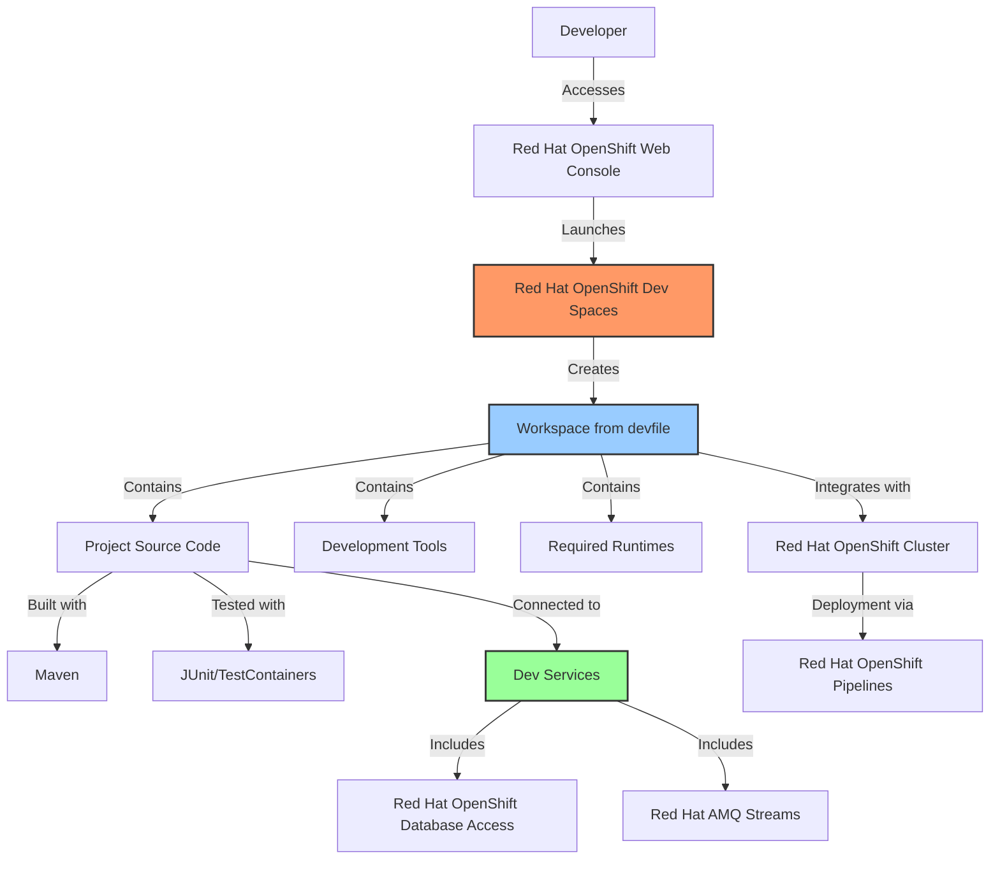

# ADR 009: Red Hat OpenShift Dev Spaces Integration

**Date:** 2025-05-06  
**Status:** Accepted  
**Deciders:** Development Team  

## Context and Problem Statement

To streamline developer onboarding and provide a consistent development environment, we need to integrate our DDD Hexagonal Architecture conference management system with Red Hat OpenShift Dev Spaces (formerly known as CodeReady Workspaces). OpenShift Dev Spaces is Red Hat's enterprise-ready cloud development environment for Kubernetes that enables developers to work with containerized environments and consistently deliver high-quality code across the entire software development lifecycle.

## Decision Drivers

* Need for consistent development environments across the team
* Desire to reduce onboarding time for new developers
* Support for remote/distributed development teams
* Integration with Red Hat OpenShift Container Platform deployment infrastructure
* Alignment with Red Hat's enterprise developer tools ecosystem
* Consistency with Red Hat's hybrid cloud vision and open source values

## Considered Options

1. **Local Development Only**: Developers use their local machines exclusively
2. **Hybrid Approach**: Red Hat OpenShift Dev Spaces for onboarding, local development for daily work
3. **OpenShift Dev Spaces First**: Primary development in Red Hat OpenShift Dev Spaces with local as fallback
4. **OpenShift Dev Spaces Only**: All development within Red Hat OpenShift Dev Spaces

## Decision Outcome

**Chosen option: OpenShift Dev Spaces First**

We've decided to adopt a "OpenShift Dev Spaces First" approach where developers primarily use Red Hat OpenShift Dev Spaces for development, with local development as a fallback option for specific scenarios.

### Implementation Strategy



### Devfile Configuration

We'll define a devfile.yaml at the root of our project to configure the Red Hat OpenShift Dev Spaces environment:

```yaml
schemaVersion: 2.1.0
metadata:
  name: ddd-hexagonal-workshop
  displayName: DDD Hexagonal Workshop
components:
  - name: tools
    container:
      image: registry.redhat.io/devspaces/udi-rhel8:latest
      memoryLimit: 2Gi
      mountSources: true
      env:
        - name: JAVA_HOME
          value: /usr/lib/jvm/java-11-openjdk
        - name: MAVEN_CONFIG
          value: /home/jboss/.m2
      endpoints:
        - name: quarkus-dev
          targetPort: 8080
          exposure: public
  - name: postgres
    container:
      image: registry.redhat.io/rhel8/postgresql-13:latest
      memoryLimit: 512Mi
      env:
        - name: POSTGRESQL_USER
          value: conference
        - name: POSTGRESQL_PASSWORD
          value: conference
        - name: POSTGRESQL_DATABASE
          value: conference_db
      endpoints:
        - name: postgres
          targetPort: 5432
          exposure: internal
  - name: kafka
    container:
      image: registry.redhat.io/amq7/amq-streams-kafka-31-rhel8:latest
      memoryLimit: 1Gi
      env:
        - name: LOG_DIR
          value: /tmp/logs
      endpoints:
        - name: kafka
          targetPort: 9092
          exposure: internal
commands:
  - id: mvn-package
    exec:
      component: tools
      commandLine: 'mvn clean package'
      workingDir: ${PROJECT_SOURCE}
  - id: run-quarkus-dev
    exec:
      component: tools
      commandLine: './mvnw compile quarkus:dev'
      workingDir: ${PROJECT_SOURCE}
  - id: run-tests
    exec:
      component: tools
      commandLine: './mvnw test'
      workingDir: ${PROJECT_SOURCE}
  - id: deploy-to-openshift
    exec:
      component: tools
      commandLine: './scripts/bootstrap_e2e.sh'
      workingDir: ${PROJECT_SOURCE}
```

### Development Workflow

1. **Environment Setup**:
   - Developer logs into Red Hat OpenShift Container Platform Web Console
   - Navigates to Red Hat OpenShift Dev Spaces and creates a new workspace from our devfile
   - Environment automatically sets up with all required Red Hat tools and dependencies

2. **Development Process**:
   - Code editing with advanced IDE features based on Red Hat-supported VS Code/Eclipse Che
   - Run the application in dev mode with Red Hat build of Quarkus using the `run-quarkus-dev` command
   - Execute tests with `run-tests` command
   - Access running services via automatically generated URLs

3. **Deployment to OpenShift**:
   - Use `deploy-to-openshift` command to deploy to development namespace in Red Hat OpenShift
   - Automated pipeline for promotion to higher environments using Red Hat OpenShift Pipelines
   - Integration with Red Hat OpenShift GitOps for declarative deployments

4. **Collaboration Features**:
   - Shared workspaces for pair programming using Red Hat OpenShift Dev Spaces
   - Environment sharing for troubleshooting
   - Consistent runtime environment for all team members using Red Hat container images
   - Integration with Red Hat Dependency Analytics for vulnerability scanning

### Additional Configuration

1. **IDE Preferences**:
   - Project-specific VS Code settings configured in `.vscode` directory
   - Shared formatting settings to maintain consistent code style
   - Recommended extensions for Java, Red Hat build of Quarkus, and DDD development

2. **Git Integration**:
   - OAuth integration with Git provider
   - Enhanced Git operations through IDE tooling
   - Integration with Red Hat OpenShift GitOps workflows

3. **Debug Configuration**:
   - Remote debugging port exposed and configured
   - Debug launch configurations for various components
   - Integration with Red Hat OpenShift developer console for logs and metrics

## Consequences

* **Positive:**
  * Drastically reduced onboarding time for new developers
  * Consistent development environment eliminates "works on my machine" issues
  * Resources can be adjusted without hardware upgrades
  * Closer alignment between development and production environments
  * Integration with Red Hat OpenShift Container Platform simplifies deployment to various environments
  * Security benefits from Red Hat's enterprise hardening and container scanning
  * Consistent experience across Red Hat's hybrid cloud environments

* **Negative:**
  * Dependency on network connectivity and OpenShift availability
  * Resource constraints in shared OpenShift clusters
  * Potential learning curve for developers not familiar with web-based IDEs
  * Limited access to certain local tools and utilities

## Validation

The success of this integration will be validated by:

* Reduced onboarding time for new developers with Red Hat OpenShift Dev Spaces
* Consistent environment across all team members using Red Hat container images
* Developer satisfaction surveys regarding the Red Hat development experience
* Reduction in environment-related issues through consistent Red Hat runtime platforms
* Smoother transition from development to production within the Red Hat OpenShift ecosystem

## Related Decisions

* ADR 008: Deployment Strategy for Red Hat OpenShift Container Platform 4.18

## References

* [Red Hat OpenShift Dev Spaces Documentation](https://access.redhat.com/documentation/en-us/red_hat_openshift_dev_spaces/) - Official documentation for Red Hat OpenShift Dev Spaces
* [Devfile Schema](https://devfile.io/docs/2.1.0/devfile-schema) - Reference for the devfile.yaml configuration format
* [Red Hat Developer's Guide to Devfile](https://developers.redhat.com/articles/2021/11/08/leverage-devfiles-rapid-application-development) - Practical guide to using devfiles for development
* [Eclipse Che: Cloud IDE for Kubernetes](https://www.eclipse.org/che/) - Open source project that powers Red Hat OpenShift Dev Spaces
* [Cloud Development Environments: Best Practices](https://www.redhat.com/architect/cloud-development-environments) - Overview of cloud-based development environment strategies